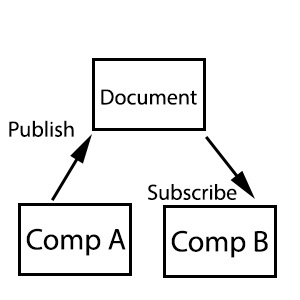
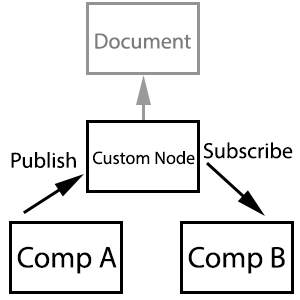

[](https://travis-ci.org/axa-ch/patterns-library)

# The AXA CH Style and HTML Guide (Editor's Draft)

Preview can be found here: https://axa-ch.github.io/patterns-library/

This is the core pattern library used for AXA Switzerland. It's based on Web-Components.
Web-Components are natively supported in modern browser. This repo contains also polyfills for those
less "cool" browsers out there. Support is:

* ie 11 (Polyfill for template, html import, shadow dom and custom element)
* EDGE (Polyfill for html import, shadow dom and custom element)
* FF (Polyfill for html import, shadow dom and custom element)
* Chrome / Chrome Mobile (100% native)
* Safari / iOS Safari (Polyfill for html import)

REF: https://github.com/webcomponents/webcomponentsjs

The main goal here to have components that are reusable with every frontend technology. It doesn't matter if you are using angular or React, you can always import the Components from the pattern library.

*At the moment, we only use Living Standard Custom Element, therefore it will run natively on Safari and Chrome on mobile and desktop.*

__Are you not familiar with Webcomponents__?
Then stop here and read this (chapter Introduction and Specification): https://www.webcomponents.org/introduction

To know how they work in your browser go to the w3c Spec. Here the link to the custom element for example: https://www.w3.org/TR/custom-elements/

Hold on, don't re-invent the wheel! Check if that what you have to do already exists: https://www.webcomponents.org/  

## Setting things up with your Repo:

Well first of all install the npm module:

`npm install --save @axa-ch/patterns-library` or while still in development better `npm install https://github.com/axa-ch/patterns-library.git --save`

Then, you can add the component of your choice simply by importing the `index.js` which is contained in the  `/dist/components/**` folder! Styles, HTML and JS will be all in one file!

**As an example:**

Import the button via `import '@axa-ch/patterns-library/dist/components/m-button'` in your `index.js` to be able to use the button. Wherever you want, add `<axa-button>Hello</axa-button>` in your html and like magic, the button will work!

If a component has dependencies to other components, you will have to add them as well. The button in the example above actually has a dependency to `a-icon`. So we will have to include it as well. **Remember, a molecule or an organism will always have dependencies to other components.** These components will work also by adding them directly with the `<script src='@axa-ch/patterns-library/dist/components/m-button'></script>` tag.

To use the webcomponents with older browsers, import the polyfills which are available under:
```js
import '@webcomponents/webcomponentsjs/bundles/webcomponents-ce';
```

or:

```html
<script src="node_modules/@webcomponents/webcomponentsjs/bundles/webcomponents-ce.js"></script>
```

A quick overview what they do:
`webcomponents-ce.js` includes Custom-Elements polyfill of the 4 parts of the webcomponents specs.
`es6-polyfills.js` are all the polyfills needed for ie11.
Alternatively to `webcomponents-ce.js`, `webcomponents-lite.js` loads all and`webcomponents-loader.js` loads the polyfills that is needed asynchronously via AJAX.

If you are using your own framework, be aware to convert the webcponents to a component for your framework (simple components like `m-button` does not need to be converted):

Do you love **angular >= 2**? Here a helpfull link for you: https://www.sitepen.com/blog/2017/09/14/using-web-components-with-angular/

Do you love **React**? Here a helpfull link for you: https://github.com/webcomponents/react-integration

Do you love **Vue**? Here a helpfull link for you: https://alligator.io/vuejs/vue-integrate-web-components/

## Main NPM commands:

* To build to dist folder, simply run `npm run build`
* to run server and watchers (this is what you want while you are developing) `npm run serve`
* to run the PROD server `npm run serve-build-prod`

## Usage guide - With just Webcomponents (no framework)

__this code snipped is tested on FF, IE11, EDGE, Chrome, Safari, Mobile Chrome, Mobile Safari__

Here an example on how to use the component button and typo in your project. The component Typo is used to show you all the possible fonts avaiable. The index.css contains all the basic page settings

```html
<html>
  <head>
    <link rel="stylesheet" href="http://localhost:8080/node_modules/patterns-library/dist/index.css">
  </head>
  <body>

    <script src="http://localhost:8080/node_modules/patterns-library/dist/app/es6-polyfills.js"></script>
    <script src="http://localhost:8080/node_modules/@webcomponents/webcomponentsjs/bundles/webcomponents-ce.js"></script>
    <script src="http://localhost:8080/node_modules/patterns-library/dist/components/u-core/index.js"></script>
    <script src="http://localhost:8080/node_modules/patterns-library/dist/components/m-button/index.js"></script>
    <script src="http://localhost:8080/node_modules/patterns-library/dist/components/a-typo/index.js"></script>

    <axa-core icons-path="./assets/icons/icons.svg"></axa-core>

    <!-- IF you need to load a bundled SVG and refer for your icons with #, then use: -->
    <axa-core only-load="true" icons-path="./assets/icons/icons.svg"></axa-core>

    <axa-button>I'm a button</axa-button>
    <axa-typo></axa-typo>
  </body>
</html>
```

## Usage guide - With React and wrapped Webcomponents


__this code snipped is tested on FF, IE11, EDGE, Chrome, Safari, Mobile Chrome, Mobile Safari__

Here an example on how to wrap very easly a webcomponent ready for react. It behaves like a real react component!

Please check also out the todomvc demo app under `src/demos/todomvc`

```html
<article style="margin-bottom: 100px;">
  <h1>Demo on how to pass a callback function:</h1>
  <div class="my-event-demo-react"></div>
</article>
```

```js
import React from 'react';
import ReactDOM from 'react-dom';
import withReact from '../js/with-react';
import AXAButton from '../components/m-button';

import './todomvc/app';

const AXAButtonReact = withReact(AXAButton);

// components are loaded already in the body cause this demo is a the end of the body

class MyEventDemoReact extends React.Component {
  constructor(props) {
    super(props);
    this.state = {
      isToggleOn: true,
    };
  }

  handleClick = () => {
    console.log('click');
    this.setState(prevState => ({
      isToggleOn: !prevState.isToggleOn,
    }));
  }

  render() {
    return ([
      <AXAButtonReact onAxaClick={this.handleClick} key={1}>{this.state.isToggleOn ? 'ON' : 'OFF'}</AXAButtonReact>,
    ]);
  }
}

document.addEventListener('DOMContentLoaded', () => {
  ReactDOM.render(<MyEventDemoReact />, document.querySelector('.my-event-demo-react'));
});

```

## Usage guide - With AEM Design importer

AEM Design Importer is used sometimes to deploy on www.axa.ch custom applications. In order to prepare it for the design importer, the Webcomponent MUST be declared differently. We will provide in future a script that does the conversion automatically, but for the moment is a manual job.

If we have a webcomponent called `<axa-button motion>Foo</axa-button>` and want to be able to use it in the AEM design importer, then we simply have to declare it using this template: `<div data-axa-wc-element="[NAME_OF_WEBCOMPONENT]" [REST_OF_ATTRIBUTES]>[INNER_CHILDS]</div>`. In our example, the button will be: `<div data-axa-wc-element="axa-button" motion>Foo</div>`.

*Keep in mind, this special way of declaring webcomponents is ONLY VALID for AXA AEM DESIGN IMPORTER. It wont work with other AEM implementations. To clarify: Webcomponents work in AEM normally. This special rule applies only for the Design Importer*

## Developers Guide:

Curious to know about webcomponent's lifecycle and our development approach?

Please see our [contribution file](./CONTRIBUTING.md).

### Publish / Subscribe between webcomponents

To listen to events and triggers between components, we use some decoupled events. This logic is included in the `BaseComponent` class and is available for every component.

The publish/subscribe system use native Custom Events (https://dom.spec.whatwg.org/#interface-customevent). Per default they don't bubble and don't cancel (no prevent default). The event name is name spaced with a slash.

Here is the declaration of the publish function:

```javascript
/**
 * Publish a message regarding a given topic.
 *
 * @param {String} topic - A string defining the topic to publish to.
 * @param {*} arg - The data associate with the generated event.
 * @param {Element} [node=document] - The node to publish message to.
 */
export function publish(topic, arg, node = document) {
  ...
}
```

The event, per default, is propagated through the document node:



Example:
```javascript
// COMP A triggers
publish('device-state/change', state);

// COMP B listens
subscribe('device-state/change', (state) => {
  ...
});

// As all the events are asynchronously, if COMP A want to know if someone specifically subscribe
// to the publish we have a system event for it. Lets say N components will or have subscribed to COMP A, but COMP A
// wants to know only when COMP B subscribed, he can listen to the Subscription event of COMP B:
subscribe('pubsub/onsubscribe/device-state/change', () => {});

```

Alternatively, you can set a custom node where the event will be triggered on:



The concept is similar to the description above, with the difference that you can pass a custom node.

```javascript
// context node here is used to encapsulate event listeners and triggers to a single container.
// In the concrete example, we want that not every mobile navigation listen to a publish event, but
// only that one which is inside a certain context. Here could be that axa-header is the containing
// context and axa navigation mobile have to listen to axa main navigation. In order to be sure that
// it listens only to one axa-header and not all potential other ones, we use the context
publish('main-navigation-mobile/close', null, this._contextNode);
subscribe('main-navigation-mobile/close', (arg) => {}, this._contextNode);
```

### Context enabler and context listener

TODO.

### Guide to for the base components:

TODO.
