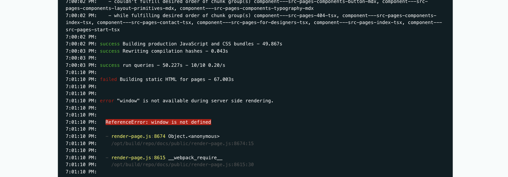

[](https://github.com/prettier/prettier)
[](https://app.netlify.com/sites/axa-design-system/deploys)

# AXA Design System

> Branding design

## Tooling

- The pages are generated with `Gatsby`
- `postcss` for the design
- Hosted on netlify, you [can check the demo](https://axa-design-system.netlify.app/)

## Getting started

```console
npm install
npm start
```

You can now view docs in the browser [http://localhost:8000/](http://localhost:8000/)
⠀
View GraphiQL, to explore your site's data and schema [`http://localhost:8000/___graphql`](http://localhost:8000/___graphql)

## Deploy

Note that the development build is not optimized.
To create a production build, use `gatsby build`

```
npm run build
```

Deploy a version to [https://axa-design-system.netlify.app/](https://axa-design-system.netlify.app/)

```console
git push origin develop
```

## Import a new axa-component workflow

🔥 Don't break the SSR rendering (Find documention on how [Debugging HTML Builds](https://www.gatsbyjs.org/docs/debugging-html-builds/))



- [ ] Go and search on https://patterns.axa.ch
- [ ] Install from `@axa-ch/sample` with `npm install @axa-ch/sample`
- [ ] Create the React-ified version with `touch src/patterns/reactified/Sample.tsx`
- [ ] export it with `@loadable/component` from `src/patterns/index.tsx`
- [ ] `import { Sample } from '../patterns/';`
- [ ] You are ready to use it with `<Sample />`

### Create a new component page

- [ ] `cp src/pages/components/sample.tsx src/pages/components/new.tsx`
- [ ] Add a link to the sidebar `src/components/GetStartedSidebar.tsx`
- [ ] Add metadata `src/IA.ts`

## Source of Truth : Tree IA

```
00-materials/
  ├── icons
  └── images

10-atoms/
  ├── button
  ├── button-link
  ├── carousel
  ├── checkbox
  ├── fieldset
  ├── heading
  ├── icon
  ├── input-file
  ├── input-text
  ├── link
  ├── radio
  ├── text
  └── textarea

20-molecules/
  ├── cookie-disclaimer
  ├── datepicker
  ├── dropdown
  ├── file-upload
  ├── footer-small
  ├── policy-features
  ├── popup
  └── top-content-bar

30-organisms/
  ├── commercial-hero-banner
  ├── container
  ├── footer
  ├── table
  ├── table-sortable
  └── testimonials
```
